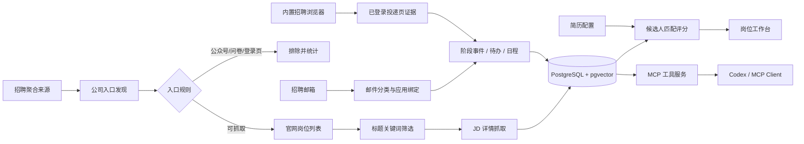

# RecruitOps Agent

> 面向校园招聘的本地优先智能工作台：从招聘源发现、岗位抓取与匹配评分，到投递记录、招聘邮件、待办日程，统一交给可审计的 Agent 工具链处理。

[](https://github.com/849879772/recruitops-agent/actions/workflows/ci.yml)
[](https://www.python.org/)
[](https://fastapi.tiangolo.com/)
[](https://github.com/pgvector/pgvector)
[](https://modelcontextprotocol.io/)
[](LICENSE)


截图来自真实本地实例并已脱敏。公司、岗位和聚合统计用于展示实际运行效果；姓名、邮箱、手机号、凭据和内部标识均未进入仓库。

## 它解决什么问题

秋招信息分散在招聘聚合页、公司官网、邮箱、个人中心和日历中。RecruitOps 将这些环节连接为一条可恢复、可复核的工作流：

1. 从招聘来源发现公司和校园招聘入口，过滤公众号、问卷、登录页等不可直接抓取入口。
2. 先按岗位标题规则筛选，再抓取需要的 JD，避免为明显无关岗位消耗浏览器和模型资源。
3. 保存公司、岗位、原始链接、抓取状态与失败原因；成功、部分成功和失败公司均可在界面追踪。
4. 使用候选人配置进行匹配评分，评分失败可从断点继续，不重复抓取完整 JD。
5. 将投递、邮件、测评、笔试、面试和待办统一到同一份状态数据中。
6. 通过 MCP 工具让 Agent 查询和执行任务，同时保留证据、幂等键和写入边界。

## 功能概览

| 能力 | 说明 |
| --- | --- |
| 招聘源发现 | 批量发现公司入口，识别无效入口，记录完整、部分成功和失败状态 |
| 岗位采集 | 标题优先筛选、动态页面与分页处理、JD 抓取、失效岗位保留 |
| 智能匹配 | 基于简历证据和方向配置评分，区分已验证技能与待学习项 |
| 投递管理 | 看板化管理已投递、笔试、面试、Offer 与已挂，保留阶段历史 |
| 招聘邮件 | IMAP 同步、招聘邮件分类、公司与岗位宽松匹配、状态事件提取 |
| 待办与日程 | 无日期事件进入待办，明确时间的测评/笔试/面试进入日程 |
| Agent 工具链 | MCP typed tools、只读默认、显式写入开关、运行心跳与崩溃恢复 |
| 内置招聘浏览器 | 在桌面软件中登录招聘网站、简历闪填、登记投递并核验官网进度 |
| 自动化任务 | 支持抓取、评分、邮件处理等周期任务，并显示最近一次运行统计 |

## 运行界面

### 投递看板与招聘邮件

| 投递阶段 | 邮件情报 |
| --- | --- |
|  |  |

### 公司来源与任务观测

| 公司抓取状态 | 最近一次全量任务 |
| --- | --- |
|  |  |

## 工作流



## 技术架构

- **应用层**：Electron 桌面壳、FastAPI、原生 Web UI、REST API。
- **Agent 层**：Codex App Server（可选）、MCP Server、领域技能与结构化工具契约。
- **数据层**：PostgreSQL 16、SQLAlchemy、pgvector、不可变阶段历史与任务检查点。
- **采集层**：Playwright、Requests、BeautifulSoup，以及招聘平台适配器。
- **可靠性**：幂等写入、批次检查点、任务心跳、失败归因、崩溃恢复和冻结评测集。

核心业务数据通过结构化数据库查询；简历解析用于岗位筛选和匹配评分。

## Windows 桌面版

桌面版适合普通用户，不需要预先安装 Docker、Python、Node.js 或 PostgreSQL：

1. 从 GitHub Releases 下载 `RecruitOps.zip`。
2. 完整解压到可写的短路径，例如 `D:\RecruitOps`，不要直接在压缩包内运行。
3. 双击唯一入口 `RecruitOps-Desktop-Preview.exe`。
4. 首次启动后在“配置”中添加模型连接、测试连接、上传简历并确认岗位关键词与行业方向。

软件将运行数据保存在程序旁的 `.data/`，升级前可备份该目录。发布包内的 PostgreSQL、Chromium、Python 和 Node.js 都是内部运行组件，不是额外启动入口。

## 源码部署

### 前置条件

- Windows 10/11、macOS 或 Linux
- Docker Desktop / Docker Engine（推荐 4 核、8 GB 内存）
- Git
- 可选：DeepSeek API Key、IMAP 应用密码、Codex CLI、Edge 浏览器

### 1. 克隆并初始化配置

```bash
git clone https://github.com/849879772/recruitops-agent.git
cd recruitops-agent
cp .env.example .env
cp config/companies.example.yaml config/companies.yaml
cp config/candidate_profile.example.yaml config/candidate_profile.yaml
cp config/rag_sources.example.yaml config/rag_sources.yaml
```

PowerShell 可将 `cp` 替换为 `Copy-Item`。

### 2. 启动 Docker 服务

```bash
docker compose up -d --build
```

等待健康检查通过后访问：

- Web/API：<http://127.0.0.1:8010>
- 健康检查：<http://127.0.0.1:8010/ready>

### 3. 启用模型（可选）

在 `.env` 中填写：

```dotenv
RECRUITOPS_LLM_ENABLED=true
RECRUITOPS_LLM_API_KEY=your-api-key
RECRUITOPS_MODEL_API_BASE_URL=https://api.deepseek.com
```

项目只暴露一个主模型配置入口。默认关闭模型调用；不开启时仍可使用岗位、公司、投递、日程与本地数据库功能。

### 4. 启用邮箱（可选）

```dotenv
RECRUITOPS_MAIL_ENABLED=true
RECRUITOPS_MAIL_IMAP_HOST=imap.example.com
RECRUITOPS_MAIL_IMAP_PORT=993
RECRUITOPS_MAIL_IMAP_USERNAME=you@example.com
RECRUITOPS_MAIL_IMAP_PASSWORD=application-password
```

建议使用邮箱应用密码。首次测试时保持 `RECRUITOPS_WRITE_ENABLED=false`，确认分类和绑定结果后再开启写入。

完整步骤见 [安装说明](docs/INSTALLATION.md)、[启动指南](docs/STARTUP_GUIDE.md) 和 [本地配置](docs/LOCAL_CONFIGURATION.md)。

## Agent 与 MCP

启动 MCP Server：

```bash
python scripts/run_mcp_server.py
```

工具覆盖岗位查询、公司来源、匹配评分、投递记录、招聘邮件、待办日程、自动化任务。所有写操作都经过统一权限边界；详细契约见 [MCP 文档](docs/MCP.md)。

项目内置领域技能：

- `job-intelligence`：岗位与匹配分析
- `crawler-operations`：招聘源发现与抓取
- `recruitment-mail`：邮件分类与状态事件
- `application-status`：投递状态核验
- `schedule-management`：待办和日程管理

## 项目结构

```text
apps/                 FastAPI 与 Web 工作台
apps/desktop/         Electron 桌面应用与内置招聘浏览器
packages/             领域模型、工具、抓取、评分、邮件与流程编排
migrations/           PostgreSQL 数据库迁移
.agents/skills/       Agent 领域技能说明
extension/            旧版可选 Edge/Chromium 浏览器扩展
scripts/              启动、迁移、诊断、备份与索引脚本
evals/                冻结评测集与可靠性评估
tests/                单元和契约测试
docs/                 架构、部署与运维文档
```

## 开发与验证

```bash
python -m venv .venv
# Windows: .venv\Scripts\activate
# Linux/macOS: source .venv/bin/activate
pip install -e ".[dev]"
playwright install chromium
python -m pytest -c pytest-public.ini
python -m compileall apps packages scripts
docker compose config
```

CI 会执行可公开复现的测试、编译检查、冻结评测、迁移校验和 Docker 构建。仓库同时保留了依赖真实公司目录、历史快照或本机浏览器环境的测试源码；这些测试未进入公开 CI，需在本地准备对应夹具后单独运行。

## 数据与隐私

仓库不包含简历、邮箱凭据、浏览器 Cookie、运行数据库或历史邮件。以下目录和文件默认被 Git 忽略：

- `.env`、`.data/`、`data/`、`outputs/`、`backups/`
- `config/candidate_profile.yaml`
- 数据库、日志、压缩包和浏览器存储状态

公开部署前请再次运行凭据扫描，并阅读 [安全策略](SECURITY.md)。界面截图只展示脱敏后的业务数据。

## 当前边界

- 招聘网站结构会变化，适配器需要持续维护；“部分成功”与“失败”会保留原始链接供人工检查。
- 登录、验证码和滑块由用户在浏览器中完成，系统不会绕过访问控制。
- 邮件和页面证据不足时保持原投递阶段，不以猜测覆盖数据库。
- 自动化任务可能持续较长时间，完成状态以心跳、检查点和最终统计为准。

## 文档

- [系统架构](docs/ARCHITECTURE.md)
- [安装与部署](docs/INSTALLATION.md)
- [抓取流程](docs/crawling_process.md)
- [Codex Runtime](docs/CODEX_RUNTIME.md)
- [浏览器扩展](docs/EXTENSION.md)
- [故障排查](docs/TROUBLESHOOTING.md)
- [贡献指南](CONTRIBUTING.md)

## License

[MIT](LICENSE)
