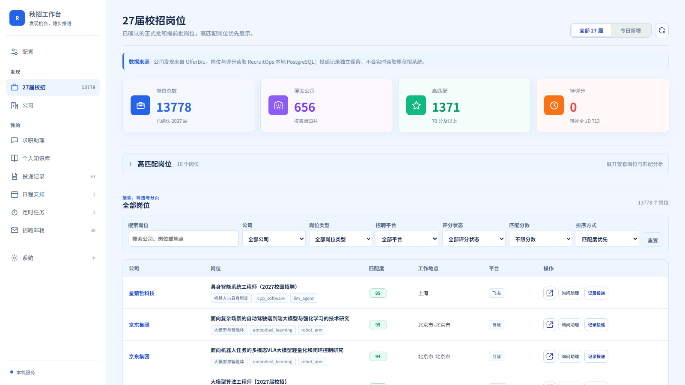
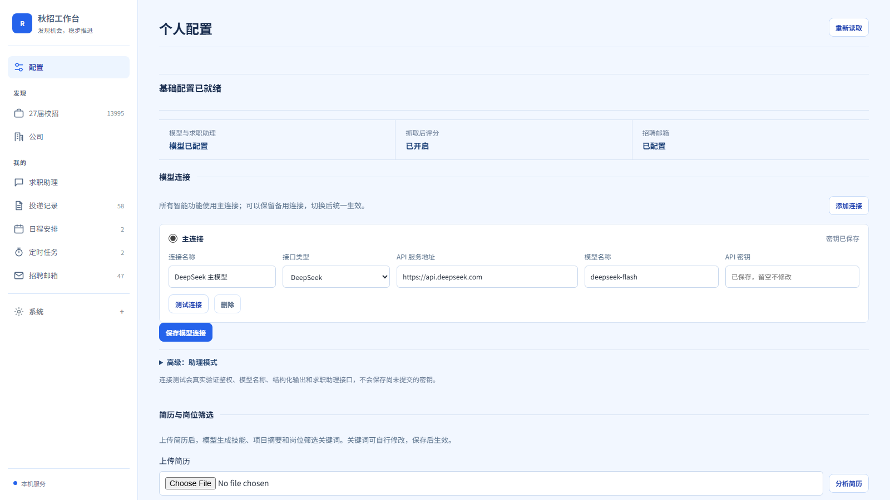
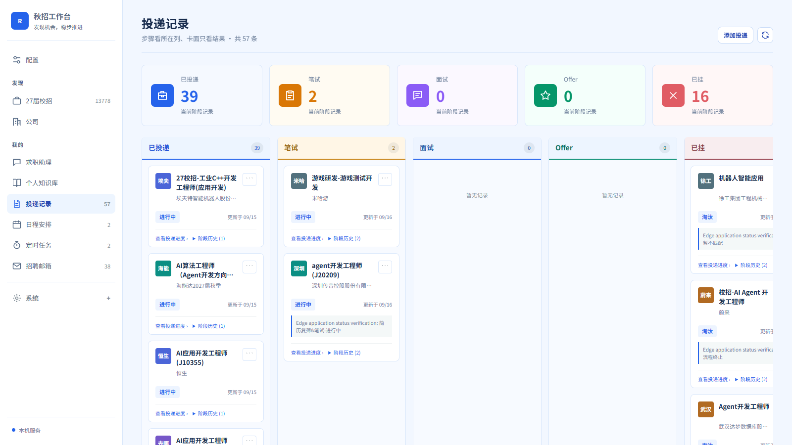
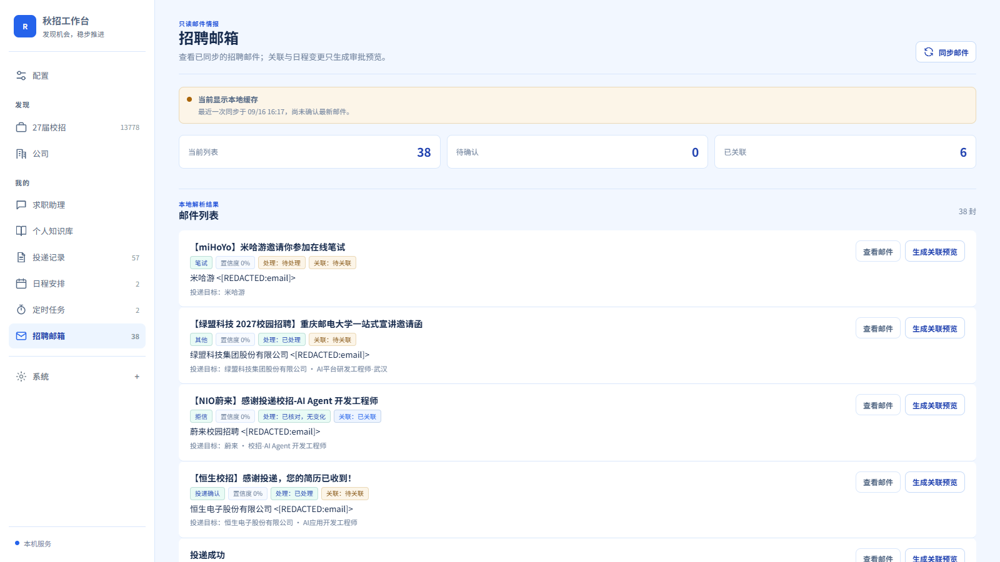
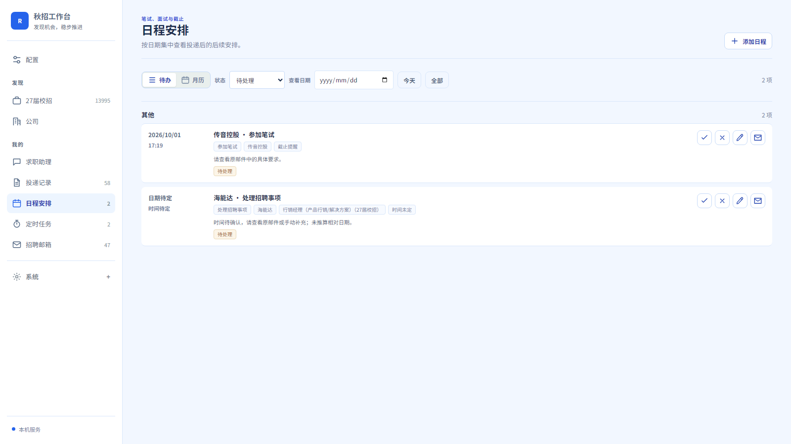
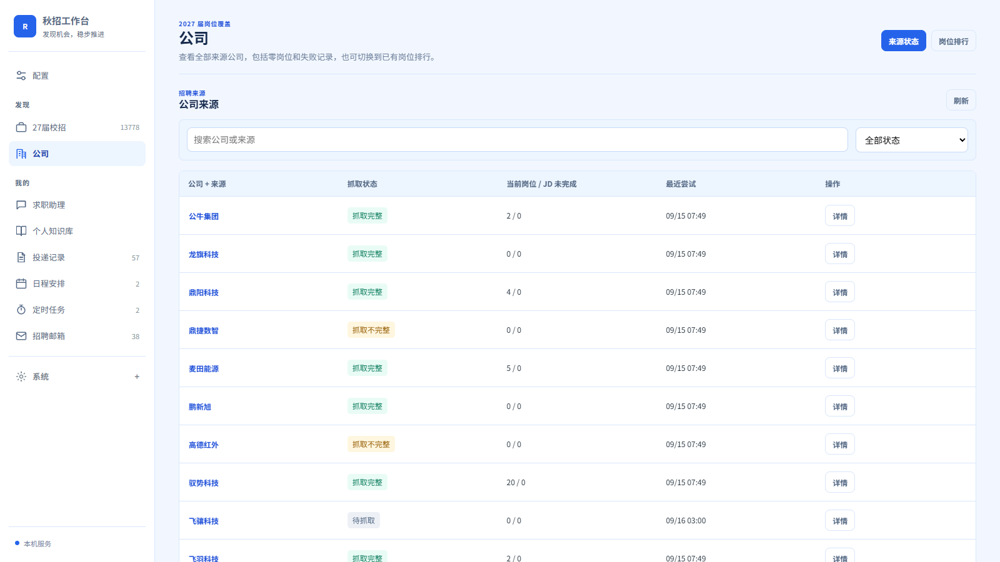
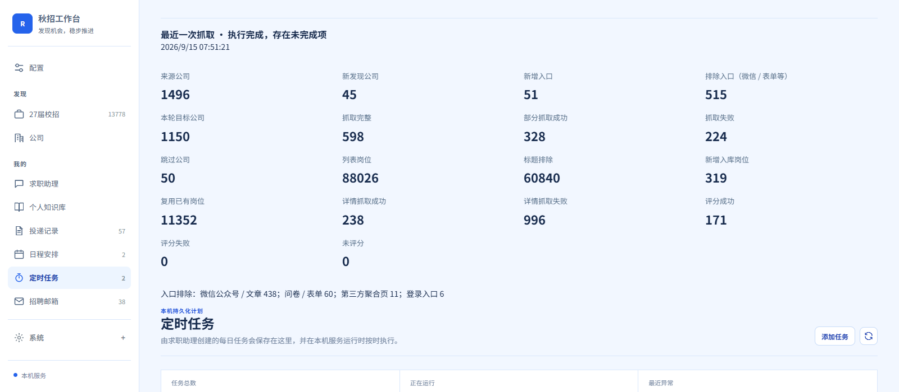

# RecruitOps 秋招工作台

> 一个面向校园招聘的 Windows 桌面软件：发现和筛选岗位、补全 JD、匹配评分、辅助投递、维护投递进度、处理招聘邮件，并把笔试、面试和待办统一到一处。

[](https://github.com/849879772/recruitops-agent/releases/latest)
[](https://github.com/849879772/recruitops-agent/releases/latest)
[](https://github.com/849879772/recruitops-agent/actions/workflows/ci.yml)
[](LICENSE)



## 主要功能

| 功能 | 能做什么 |
| --- | --- |
| 校招岗位发现 | 从招聘聚合来源获取公司和校招入口，持续维护可抓取的官网来源 |
| 岗位抓取与 JD 补全 | 抓取岗位列表，先按标题关键词筛选，再补全需要分析的岗位详情 |
| 简历解析与匹配评分 | 从简历生成技能、项目摘要和岗位关键词，按个人背景给岗位评分并解释优势与不足 |
| 内置招聘浏览器 | 在软件内打开招聘官网、保留登录状态、扫描表单并进行简历闪填 |
| 投递记录 | 手动登记或从内置浏览器保存投递，维护已投递、笔试、面试、Offer 和已挂阶段 |
| 官网进度复核 | 只复核未挂岗位，读取官方投递记录页并保留阶段证据，不用低优先级信息覆盖已确认进度 |
| 招聘邮箱 | 通过只读 IMAP 同步招聘邮件，识别投递、测评、笔试、面试和拒信 |
| 日程与待办 | 将有明确时间的招聘事项加入日程，将时间未定的事项保留为待办 |
| 求职助理 | 用自然语言查询岗位、处理邮件、复核投递进度、运行抓取和管理定时任务 |
| 自动化任务 | 为抓取、评分、邮箱处理和投递复核设置多个每日执行时间，查看执行详情和失败原因 |

## 下载与启动

### 系统要求

- Windows 10 或 Windows 11，64 位
- 建议至少 8 GB 内存
- 建议预留 3 GB 可用磁盘空间
- 能访问模型 API、招聘网站和邮箱 IMAP 服务的网络

### 1. 下载桌面版

当前可用版本为 RecruitOps v0.1.2，请下载 `RecruitOps-v0.1.2.zip`：

- [GitHub Releases](https://github.com/849879772/recruitops-agent/releases/tag/v0.1.2)

安装包大小约 704 MB。下载完成后可按需核对 SHA-256：

```text
5B3BC2FC33CED011111FFDCF66DF20956D2286A0228F3F7D70DB3552B892199D
```

### 2. 完整解压

将压缩包完整解压到可写的短路径，例如：

```text
D:\RecruitOps
```

不要直接在压缩包预览窗口中运行，也不要只复制其中的 EXE。数据库、Python、Node.js、Chromium 和 PostgreSQL 都是软件的内部组件，必须和主程序保持原有目录结构。

### 3. 启动唯一入口

双击：

```text
RecruitOps-Desktop-Preview.exe
```

普通用户只需要运行这一个文件，不需要启动 CMD 脚本，也不需要单独启动目录里的其他程序。首次启动会初始化本地数据库和运行组件，时间可能比之后启动稍长。

> 桌面版不要求预先安装 Docker、Python、Node.js、PostgreSQL 或浏览器插件。

## 首次配置

启动后进入左侧 **配置** 页面，按下面顺序完成设置。

### 1. 配置模型连接

1. 点击 **添加连接**，或编辑已有的主连接。
2. 选择 `DeepSeek` 或 `OpenAI 兼容接口`。
3. 填写 API 服务地址、模型名称和 API Key。
4. 点击 **测试连接**。测试会检查鉴权、模型名称、结构化输出和求职助理接口。
5. 测试通过后点击 **保存模型连接**。

可以保存多个连接，但同一时间只有一个主连接。简历解析、岗位评分、邮件理解和求职助理都使用当前主连接。

### 2. 上传并分析简历

1. 上传文字版 PDF、TXT 或 Markdown 简历，文件最大 10 MB。
2. 点击 **分析简历**。
3. 系统会提取学历、技能、项目依据和岗位筛选关键词。
4. 检查模型生成的关键词，根据自己的求职目标增删后再保存。

岗位筛选关键词不能为空。它们用于第一轮标题筛选，决定哪些岗位值得继续抓取 JD 和评分。扫描版 PDF 如果没有文字层，请先转换为可复制文字的 PDF。

### 3. 选择岗位范围

- 招聘类型固定为校招正式岗位。
- 社招和实习默认排除，不需要额外配置。
- 在 **OfferBiu 行业大类** 中选择希望关注的行业方向。
- 行业方向控制公司来源范围，岗位关键词控制具体公司内保留哪些岗位。

### 4. 配置招聘邮箱

1. 在邮箱网页设置中开启 IMAP。
2. 创建授权码或应用专用密码，不要填写网页登录密码。
3. 在 RecruitOps 中选择邮箱服务商，或填写自定义 IMAP 地址和 SSL 端口。
4. 填写完整邮箱地址、授权码和邮件文件夹，通常为 `INBOX`。
5. 点击 **测试邮箱连接**，通过后保存。

网易 163 可直接选择预设；其他支持账号密码或应用密码登录 IMAP 的邮箱可使用自定义配置。仅支持 OAuth2 且不允许 IMAP 应用密码的 Gmail、Outlook 账号，当前版本暂不支持。

### 5. 保存配置

点击页面底部的 **保存并完成首次配置**。模型连接、简历关键词和行业范围准备完成后，求职助理、抓取后评分和本地定时任务会按配置自动启用，不需要再寻找额外开关。部分运行配置变更会提示重启桌面软件后生效。



## 从零开始使用

### 第一步：抓取并评分岗位

进入 **求职助理**，发送类似下面的指令：

```text
完成一次全量岗位抓取并评分
```

也可以让助理创建每日定时任务。一次全量流程依次执行：

1. 从 OfferBiu 等来源同步公司和校园招聘入口。
2. 排除公众号、问卷、登录页、个人中心等不可直接抓取的入口。
3. 抓取各公司当前岗位列表并保存抓取状态。
4. 按岗位标题关键词筛出相关岗位。
5. 对 JD 缺失或不完整的候选岗位抓取详情。
6. 对公司和岗位进行去重、更新和失效标记。
7. 使用简历事实完成匹配评分和优势、劣势分析。
8. 保存检查点和最终统计；长任务中断后可从检查点恢复。

任务进度中的“需要补全 JD”表示当前候选集中 JD 不完整的岗位数量，不等于本轮新抓取到的关键词命中岗位数。

### 第二步：查看和筛选岗位

进入 **27 届校招**：

- 按公司、岗位类型、招聘平台、评分状态和匹配分筛选。
- 高匹配岗位优先展示。
- 打开岗位详情可查看保存的 JD、匹配摘要、个人优势和待补足项。
- 点击招聘页按钮可在内置浏览器中打开岗位。

### 第三步：在内置浏览器投递

1. 打开目标公司的招聘页。
2. 在页面中自行完成登录、验证码或滑块验证。
3. 点击桌面工具栏的 **简历闪填**。
4. 扫描当前页面后，软件会尝试填写能够可靠识别的文本框、单选、多选、下拉框、重复经历和附件字段。
5. 检查内容后由你手动提交，软件不会代替用户完成最终提交。
6. 投递完成后，在 **投递记录** 页签填写公司、岗位、投递进度链接等信息并保存。

内置浏览器会为不同站点保存独立登录状态。验证码、密码和最终提交始终由用户处理。

### 第四步：维护投递进度

进入 **投递记录** 可以：

- 手动添加、编辑或删除记录。
- 打开保存的官方投递进度页。
- 查看阶段历史和证据说明。
- 让助理批量复核所有非终态岗位。

状态更新采用只升不降的优先级：已由邮件、人工或可靠官网证据确认的笔试、面试等阶段，不会因为官网只显示“已投递”“筛选中”或没有状态文本而被降级。



### 第五步：处理邮件和日程

进入 **招聘邮箱** 点击 **同步邮件**，或让求职助理处理未处理邮件。已成功处理的邮件会保存处理状态，后续同步不会重复执行同一事件；需要人工确认的邮件会保留在待确认列表。

邮件中的测评、笔试和面试如果包含明确日期，会生成日程；只有截止时间但没有具体开始时间的事项会以截止提醒保存；时间不明确的事项进入待办。

| 招聘邮箱 | 日程安排 |
| --- | --- |
|  |  |

### 第六步：查看公司来源和任务状态

进入 **公司** 可以查看每个招聘来源的入口地址、抓取状态、岗位数量、JD 未完成数量和最近尝试时间。`抓取完整`、`抓取不完整` 与 `无法抓取` 会分别保留，便于后续重试和排查。



进入 **定时任务** 可以查看：

- 每天的多个执行时间
- 是否启用、下次运行时间和最近运行时间
- 最近一次执行状态、耗时和结构化结果
- 失败原因以及 **让助理解释** 入口

定时任务依赖本地服务运行；需要在计划时间保持 RecruitOps 桌面软件开启。错过的时间点不会假装执行成功。



## 数据保存与升级

运行数据默认保存在软件目录旁的：

```text
.data\
```

其中包含本地数据库、配置、任务检查点和招聘网站登录状态。建议定期备份整个 `.data` 目录。

升级步骤：

1. 退出 RecruitOps。
2. 备份旧版本的 `.data`。
3. 将新版本完整解压到新的短路径。
4. 将旧版本 `.data` 复制到新版本相同位置。
5. 启动新版本唯一的 EXE，等待数据库迁移完成。

不要在软件运行时复制数据库，也不要把新版本直接覆盖到正在使用的旧目录。

## 常见问题

### 到底应该启动 EXE 还是 CMD？

只启动 `RecruitOps-Desktop-Preview.exe`。CMD、内部 Python、Node.js 和 PostgreSQL 程序都不是用户入口。

### 桌面版需要 Docker 吗？

不需要。Releases 中的压缩包已经包含完整运行环境。Docker 只面向阅读源码、参与开发、运行 CI 或部署服务端环境的开发者。

### 首次打开为什么没有岗位？

新安装默认是空数据。完成模型、简历关键词和行业范围配置后，运行一次全量抓取，岗位和公司数据才会逐步入库。

### 出现 `missing_resource`、`packaged_isolation_root_required` 或 `init_db_failed` 怎么办？

1. 确认下载的是完整 Release 压缩包。
2. 重新完整解压到 `D:\RecruitOps` 这类短路径。
3. 不要只移动 EXE，不要从压缩包内运行。
4. 确认当前目录可写，并暂时避开网盘同步目录、系统保护目录和过长路径。
5. 如果旧目录曾启动失败，先备份 `.data`，再使用全新目录测试。

### 求职助理不可用怎么办？

回到 **配置** 页面测试主模型连接。检查 API Key、服务地址、模型名称和账户额度；保存后如果页面提示需要重启，请退出并重新打开软件。

### 邮箱连接失败怎么办？

确认邮箱已开启 IMAP，并使用授权码或应用专用密码。网页登录密码通常不能用于第三方 IMAP 客户端。

### 招聘官网打不开或状态读取失败怎么办？

先在内置浏览器中手动完成登录和验证码，等待岗位列表或投递记录完整渲染，再重新扫描。系统不会绕过登录、验证码、滑块或网站访问限制。

### Windows 提示未知发布者怎么办？

当前便携版可能尚未进行商业代码签名。请确认压缩包来自本仓库 Releases，并核对 Release 页面提供的 SHA256 后再运行。

## 源码运行（开发者）

普通用户请使用上面的 Windows 桌面版。下面内容仅用于二次开发、调试和贡献代码。

### Docker 开发环境

仓库保留 Docker 配置，用于统一 PostgreSQL、API 和 CI 环境；它不是桌面软件的用户安装方式。

```bash
git clone https://github.com/849879772/recruitops-agent.git
cd recruitops-agent
cp .env.example .env
cp config/companies.example.yaml config/companies.yaml
cp config/candidate_profile.example.yaml config/candidate_profile.yaml
docker compose up -d --build
```

PowerShell 可将 `cp` 替换为 `Copy-Item`。服务启动后访问：

- Web/API：<http://127.0.0.1:8010>
- 健康检查：<http://127.0.0.1:8010/ready>

停止开发环境：

```bash
docker compose down
```

### 本地开发与测试

```bash
python -m venv .venv
# Windows: .venv\Scripts\activate
# Linux/macOS: source .venv/bin/activate
pip install -e ".[dev]"
playwright install chromium
uvicorn apps.api.main:app --reload --port 8010
python -m pytest -c pytest-public.ini
python -m compileall apps packages scripts
docker compose config
```

## 技术架构

- **桌面层**：Electron、内置招聘浏览器、站点隔离登录和简历闪填面板
- **应用层**：FastAPI、原生 Web UI、REST API
- **Agent 层**：MCP typed tools、领域技能、工具路由、审批与审计边界
- **数据层**：PostgreSQL 16、SQLAlchemy、阶段历史和任务检查点
- **采集层**：Playwright、Requests、BeautifulSoup、招聘平台适配器
- **可靠性**：幂等写入、分批执行、心跳、断点恢复、失败归因和冻结评测集

核心岗位、投递、邮件和日程使用结构化数据库查询；模型主要负责简历解析、岗位评分、邮件理解和工具调用。

## 项目结构

```text
apps/                 FastAPI API 与 Web 工作台
apps/desktop/         Electron 桌面壳、内置浏览器和简历闪填
packages/             领域模型、抓取、评分、邮件、工具和流程编排
migrations/           PostgreSQL 数据库迁移
config/               公司来源与候选人配置示例
.agents/skills/       求职助理领域技能
scripts/              启动、迁移、诊断、备份和发布脚本
evals/                冻结评测集与可靠性评估
tests/                单元、集成与契约测试
docs/                 架构、安装、运行和故障排查文档
```

## 安全说明

- API Key、邮箱授权码和招聘网站登录状态只保存在本机运行目录中。
- `.env`、`.data/`、数据库、日志、备份和候选人配置默认不进入 Git。
- 不要将自己的 `.data` 目录、简历、浏览器存储或邮箱配置上传到公开仓库。
- 登录、验证码、滑块和最终投递提交由用户本人完成。
- 邮件与官网证据不足时保留原状态，不用猜测覆盖已确认进度。

发现安全问题请阅读 [SECURITY.md](SECURITY.md)。

## 支持作者

如果这个项目对你有帮助，欢迎请作者喝杯咖啡。感谢你的支持，它会帮助项目继续维护和完善。

<p align="center">
  
</p>

## 更多文档

- [安装与部署](docs/INSTALLATION.md)
- [启动指南](docs/STARTUP_GUIDE.md)
- [系统架构](docs/ARCHITECTURE.md)
- [抓取流程](docs/crawling_process.md)
- [MCP 工具](docs/MCP.md)
- [故障排查](docs/TROUBLESHOOTING.md)
- [贡献指南](CONTRIBUTING.md)

## License

[MIT](LICENSE)
